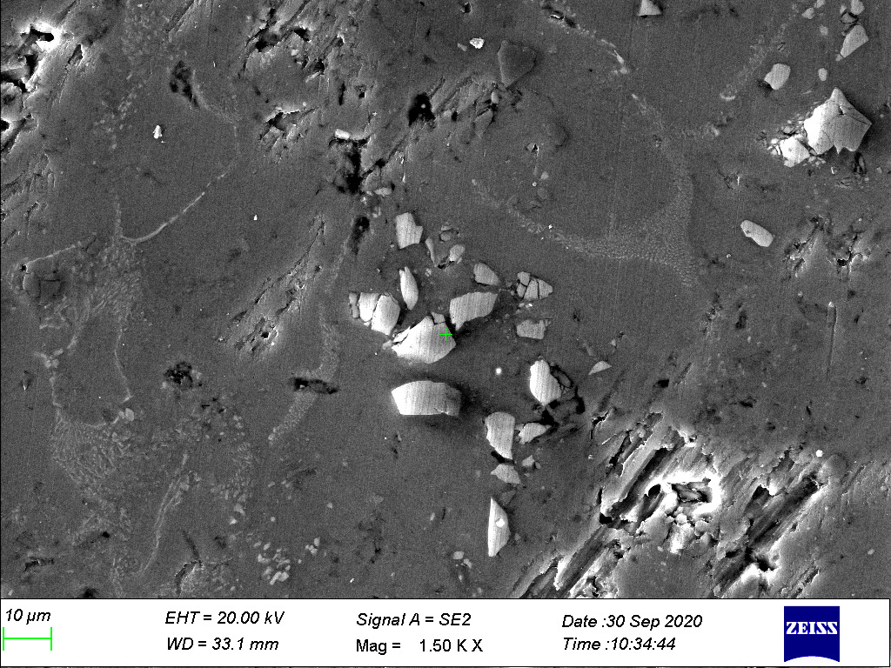

# particle_size_detection

The objective is to analyse images of a composite obtained from an SEM and and compute the distribution of particles and and the size vs frequency histogram of the material.

The lighter patches consist of SiC (Silicon carbide) particles in a metallic medium.